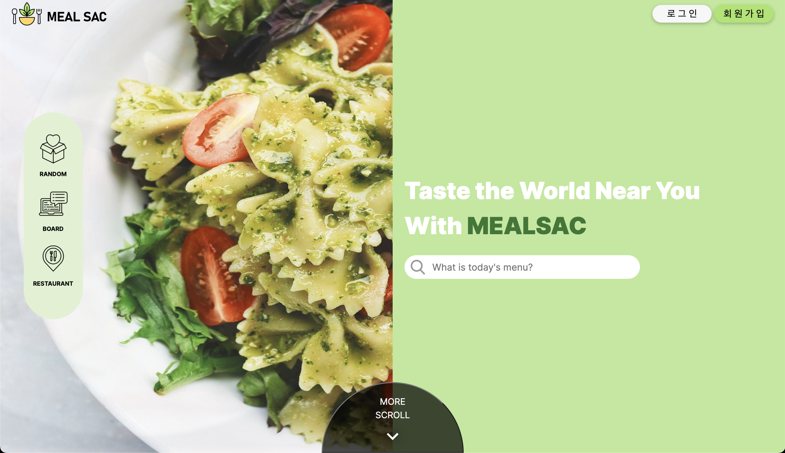
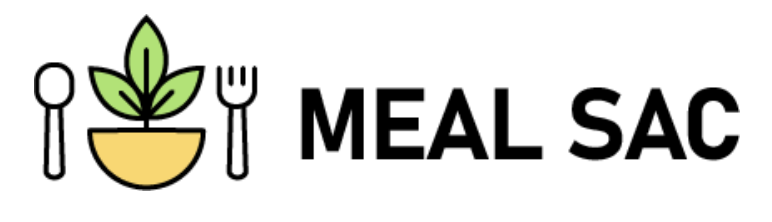
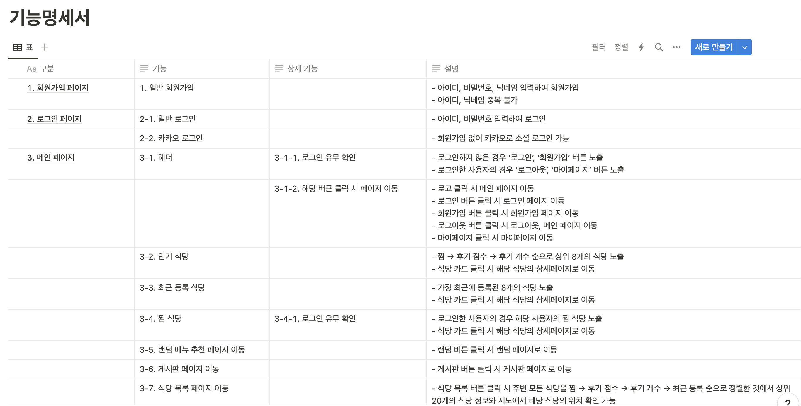
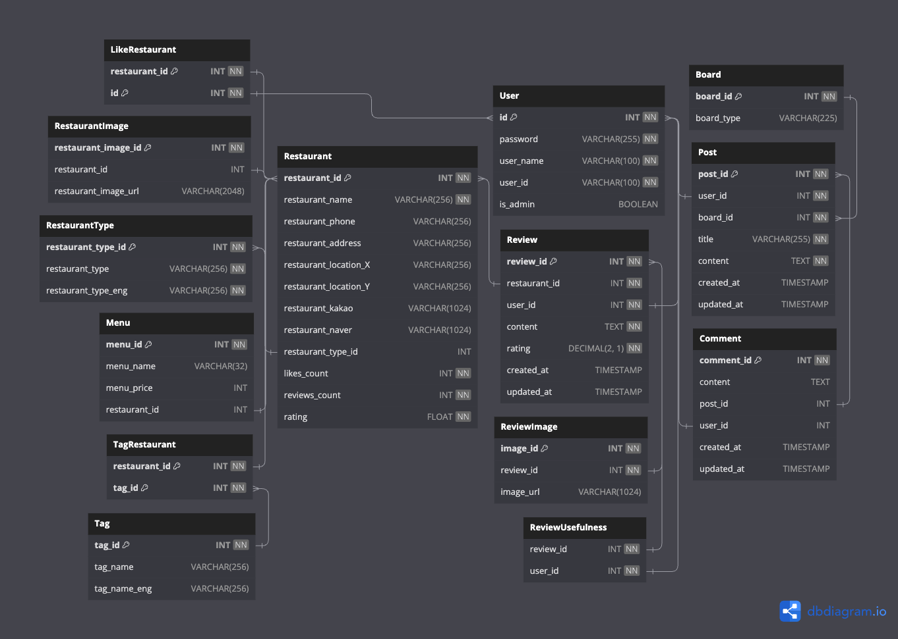

# **🪴 mealsac**

<br><br>

<p align="center">

[](http://ec2-54-146-187-238.compute-1.amazonaws.com:8080)

</p>

<br><br>

## **1\. 기획의도 & 목적**

#### "매일 반복되는 오늘 뭐 먹지? 이 근처 식당 뭐 있지? 이제 그만!"

> seSAC 영등포 캠퍼스 크루들을 위한 식당 큐레이팅 및 커뮤니티 웹서비스입니다.

<br>

[](http://ec2-54-146-187-238.compute-1.amazonaws.com:8080/)

#### 🔍 배너 클릭해서 사이트 구경하기!

<br/><br/>

## **2\. 웹 서비스의 최종적인 메인 기능과 서브 기능 설명**

### **✨ 메인기능**

##### - 식사 메뉴 추천

##### - 주변 식당 정보, 지도 위치 확인

##### - 주변 식당명, 메뉴, 카테고리, 태그 검색 기능

##### - 식당 상세 정보 조회

##### - 마이페이지

<!-- ##### - 게시판 -->

<br>

### **✨ 서브기능**

##### - 카카오 로그인

##### - 전체 식당의 인기순, 평점순, 최근 등록순 정렬 기능

##### - 식당 찜

##### - 식당 후기

##### - 식당 후기 추천

##### - 카카오로그인

##### - 메인페이지

##### - 네이버/카카오 길찾기 연결

<br/><br/>

## **3\. 프로젝트만의 차별점, 기대 효과**

### **🔥 매일매일 고민하던 식사에 대한 고민을 덜어줄 웹서비스를 만들었습니다.**

##### - 설문조사를 통한 메뉴 추천 서비스

##### - seSAC 영등포 캠퍼스와 식당의 위치를 한눈에 확인해 거리를 가늠할 수 있도록 지도가 포함된 레이아웃

##### - 식당 검색 시 평점, 찜 개수, 리뷰 수, 최근 등록 순으로 정렬된 정보 확인

##### - 위치를 보여주는 것이 아닌 네이버/카카오 지도를 통한 길찾기 기능

##### - 식당 찜을 통해 마이페이지에서 쉽게 찜한 식당 확인

##### - 후기 작성을 통해 해당 식당의 실제 정보 공유

##### - 마이페이지에서 내가 찜한 식당, 내 작성한 리뷰, 내가 작성한 게시글을 쉽게 확인

<!-- ##### - 게시판을 통해 유저들끼리 자유롭게 소통 -->

<!-- ##### - 공지사항을 통한 공지 확인 -->

<br/><br/>

## **4\. 스토리보드 및 유저 시나리오**

### **⭐️ 사용자**

##### - 사용자는 메인페이지에서 회원가입 버튼을 통해 회원가입 페이지로 이동할 수 있다.

##### - 사용자는 메인페이지에서 로그인 버튼을 통해 로그인 페이지로 이동할 수 있다.

##### - 사용자는 로그인 페이지에서 가입한 아이디와 비밀번호를 입력하거나 카카오 로그인을 통해 로그인할 수 있다.

##### - 사용자는 로그인하면 메인페이지로 이동한다.

##### - 사용자는 메인페이지에서 인기 식당, 최근 등록 식당, 내가 찜한 식당을 확인할 수 있으며 식당 클릭 시 해당 식당의 상세페이지로 이동한다.

##### - 사용자는 메인페이지에서 랜덤 버튼을 클릭하여 선택지를 통한 메뉴 추천을 받을 수 있다.

##### - 사용자는 메인페이지에서 게시판 버튼을 클릭하여 게시판으로 이동하며 바로 자유 게시판의 게시글을 볼 수있다.

##### - 사용자는 상단의 로그아웃 버튼을 클릭하여 로그아웃할 수 있다.

##### - 사용자는 상단의 마이페이지 버튼을 클릭하여 마이페이지로 이동할 수 있다.

##### - 사용자는 마이페이지에서 찜목록, 리뷰목록, 글목록을 볼 수 있다.

##### - 사용자는 마이페이지에서 찜목록에서 해당 식당의 상세페이지로 이동할 수 있다.

##### - 사용자는 마이페이지에서 리뷰를 수정하거나 삭제할 수 있다.

##### - 사용자는 식당 버튼을 통해 식당 목록 페이지로 이동할 수 있다.

##### - 사용자는 식당 목록 페이지에서 식당의 위치를 지도에서 각 카테고리에 맞는 아이콘으로 볼 수 있다.

##### - 사용자는 식당 목록 페이지에서 전체 식당의 정보를 인기순, 평점순, 최근 등록순으로 정렬하여 정보를 확인할 수 있다.

##### - 사용자는 식당 목록 페이지에서 식당명으로 식당을 검색할 수 있다.

##### - 사용자는 식당 목록 페이지에서 메뉴명으로 식당을 검색할 수 있다.

##### - 사용자는 식당 목록 페이지에서 카테고리로 식당을 검색할 수 있다.

##### - 사용자는 식당 목록 페이지에서 태그로 식당을 검색할 수 있다.

##### - 사용자는 식당 목록 페이지에서 특정 식당을 찜할 수 있다.

##### - 사용자는 식당 목록 페이지에서 버튼을 통해 식당 상세페이지로 이동할 수 있다.

##### - 사용자는 식당 상세 페이지에서 해당 식당의 정보를 확인할 수 있다.

##### - 사용자는 식당 상세 페이지에서 해당 식당을 찜할 수 있다.

##### - 사용자는 식당 상세 페이지에서 해당 식당의 전화번호를 복사하거나 바로 전화할 수 있다.

##### - 사용자는 식당 상세 페이지에서 네이버/카카오 지도와 연결된 버튼을 클릭하여 길찾기를 할 수 있다.

##### - 사용자는 식당 상세 페이지에서 대표메뉴와 가격을 볼 수 있다.

##### - 사용자는 식당 상세 페이지에서 후기와 평점을 남길 수 있다.

##### - 사용자는 식당 상세 페이지에서 작성된 후기에 추천을 할 수 있다.

##### - 사용자는 식당 상세 페이지에서 본인이 작성한 후기를 수정/삭제 할 수 있다.

##### - 사용자는 마이페이지에서 찜 목록, 후기 목록, 게시글 목록을 확인할 수 있다.

##### - 사용자는 마이페이지에서 회원정보 버튼을 클릭해 회원정보 페이지로 이동할 수 있다.

##### - 사용자는 회원정보 페이지에서 비밀번호와 닉네임을 변경할 수 있다.

##### - 사용자는 마이페이지에서 회원정보 버튼을 클릭해 회원정보 페이지로 이동할 수 있다.

##### - 사용자는 마이페이지에서 찜 목록의 상세페이지 버튼을 통해 해당 식당의 상세페이지로 이동할 수 있다.

##### - 사용자는 마이페이지에서 후기를 수정하거나 삭제할 수 있다.

<br/><br/>

## **5\. 프로젝트 구성**

### **🔧 기술 스택**

#### **Front-end**

 
 
 


#### **Back-end**

  
 


<br>

### 🎨  **협업 도구**

#####  - Code Repository

#####  - API 사용 상세 설명

#####  - 와이어프레임, 통일성을 위해 사용

#####  - 팀원간의 실시간 커뮤니케이션

#####  - 커뮤니케이션 및 비대면 스크럼 진행

#####  - API 명세서, API DOCS등 활용

<br/>

### 🪄 **기능 명세서**

<h align="center">[](https://www.notion.so/93e38d8e51db40c09af9555a12758671?v=80d1a5c5840a4a5584e7cc27a30a9d99)</h>

#### 기능명세서 자세히 보고 싶다면 사진 클릭

<br/>

### 🧬 **ERD(Entity Relationship Diagram)**

<h align="center"></h>
<br><br>

<br/>

### 📌  **스크럼**

##### - 월/수/금 오후 1시 30분, 화/목 오후 3시 스크럼 진행

##### - 프론트, 백의 개발 진행상황 및 이슈 공유

<br>

#### 📎 **커밋 컨벤션**

```
# --- COMMIT END ---
#   <타입> 리스트
#   feat        : 기능 (새로운 기능)
#   fix         : 버그 (버그 수정)
#   refactor    : 리팩토링
#   design      : CSS 등 사용자 UI 디자인 변경
#   comment     : 필요한 주석 추가 및 변경
#   style       : 스타일 (코드 형식, 세미콜론 추가: 비즈니스 로직에 변경 없음)
#   docs        : 문서 수정 (문서 추가, 수정, 삭제, README)
#   test        : 테스트 (테스트 코드 추가, 수정, 삭제: 비즈니스 로직에 변경 없음)
#   chore       : 기타 변경사항 (빌드 스크립트 수정, assets, 패키지 매니저 등)
#   init        : 초기 생성
#   rename      : 파일 혹은 폴더명을 수정하거나 옮기는 작업만 한 경우
#   remove      : 파일을 삭제하는 작업만 수행한 경우
# ------------------
```

<br/><br/><br/>

## **6\. 파일 및 폴더 구성**

```
src
┣ actions
┃ ┣ controllers
┃ ┣ models
┃ ┣ routes
┃ ┣ static
┃ ┃ ┣ css
┃ ┃ ┣ img
┃ ┃ ┗ js
┃ ┣ utils
┃ ┣ views
┃ ┃ ┣ board
┃ ┃ ┣ boardModify
┃ ┃ ┣ boardPost
┃ ┃ ┣ boardWrite
┃ ┃ ┣ common
┃ ┃ ┣ login
┃ ┃ ┣ mypage
┃ ┃ ┣ profile
┃ ┃ ┣ random
┃ ┃ ┣ register
┃ ┃ ┣ restaurantDetail
┃ ┃ ┣ restaurantList
┃ ┃ ┣ 404.ejs
┃ ┃ ┣ index.ejs
┃ ┃ ┗ swagger.js
┗ app.js
```

<br/>

| **이름** | **역할**     |
| -------- | ------------ |
| 조가인   | 풀스택, 팀장 |
| 박준수   | 풀스택       |
| 전수현   | 프론트엔드   |
| 박장혁   | 프론트엔드   |
| 이재욱   | 백엔드       |
